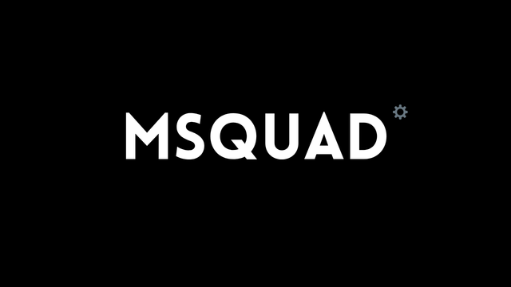

# MSQUAD - Equipe de Desenvolvimento Enterprise

<p align="center">
  
</p>

---

## Visão Geral

MSQUAD é a equipe de desenvolvimento de software mais avançada do mercado, operando com governança enterprise e metodologia comprovada de Trilhões em equity.

---

## Missão

Entregar software de excelência com governança enterprise, executando com precisão militar e qualidade que gera valor de Trilhões.

---

## Equipe

| Role | Membro | Função |
|------|--------|--------|
| CTO | Napoleão | Estratégia, governança, gates |
| PO | César | Negócio, valor |
| Architect | Nelson | Arquitetura, padrões |
| Dev | Edison | Código, implementação |
| QA | Grace | Qualidade, validação |
| Ops | Arquimedes | Deploy, entrega |

---

## Processo com Gates

1. **Gate 1** - Napoléon valida estratégia
2. **Gate 2** - Nelson valida arquitetura
3. **Gate 3** - Edison implementa + Code Review
4. **Gate 4** - Grace valida qualidade
5. **Gate 5** - Arquimedes deploy
6. **Gate 6** - Napoléon reporta

---

## Valores

- ✅ Execução acima de tudo
- ✅ Qualidade não negociável
- ✅ Resultado no prazo
- ✅ Inovação constante
- ✅ Colaboração absoluta
- ✅ Governança acima de tudo

---

## Uso

### Via OpenCode

O MSQUAD é detectado automaticamente pelo OpenCode. Copie a pasta `msquad/` para seu projeto e use:

```
1. npm init [projeto]
2. Copiar msquad/ para dentro do projeto
3. Usar via OpenCode
```

### Integração

- Agents: Configuração de IA para orquestração
- Skills: Capacidades especializadas da equipe
- Docs: Documentação completa

---

## Roadmap

- [x] Estrutura base criada
- [x] 6 membros especializados
- [x] Processo com gates
- [x] Brand enterprise
- [ ] Publicação GitHub ← Você está aqui
- [ ] Primeira release

---

## Licença

Licença Proprietária - Todos os direitos reservados. See [LICENSE](LICENSE) for details.

---

<p align="center">
  <strong>MSQUAD - Equity de Trilhões</strong>
</p>
